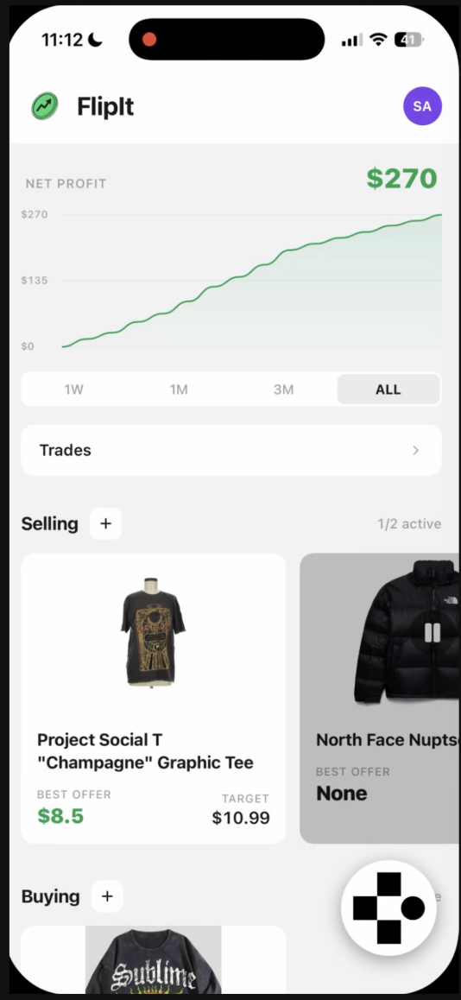
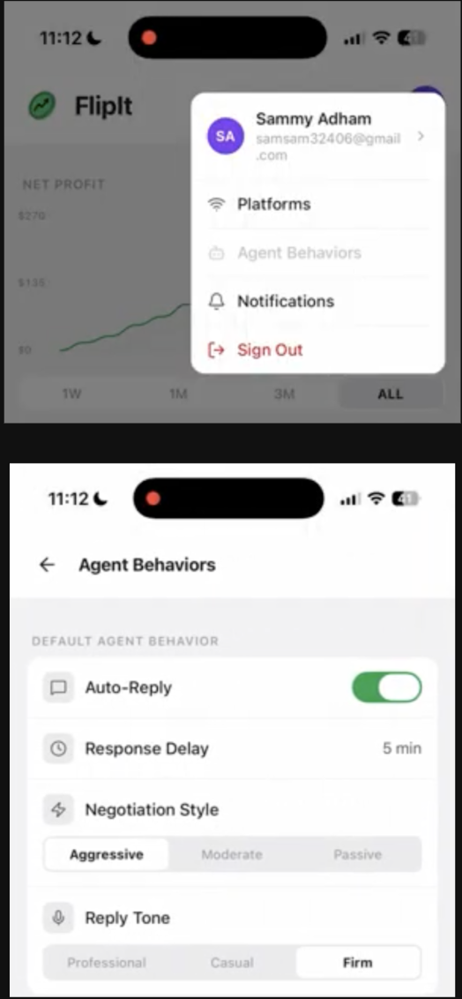
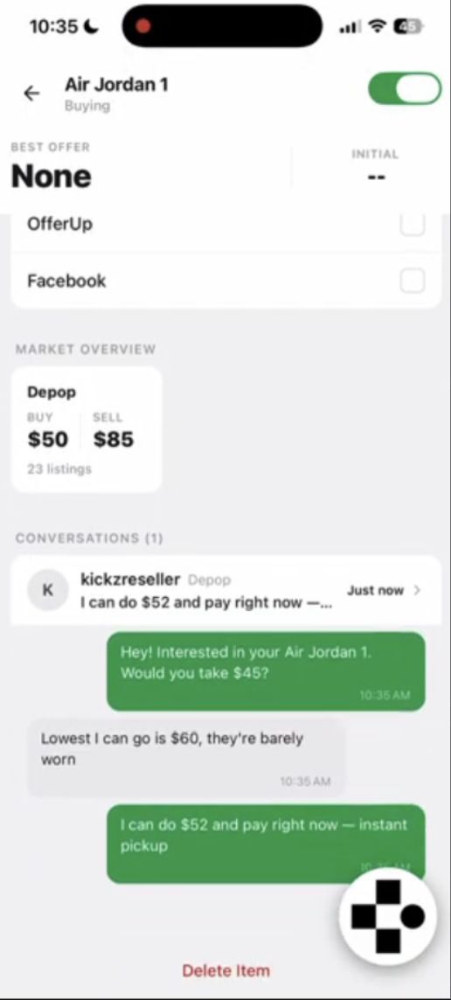
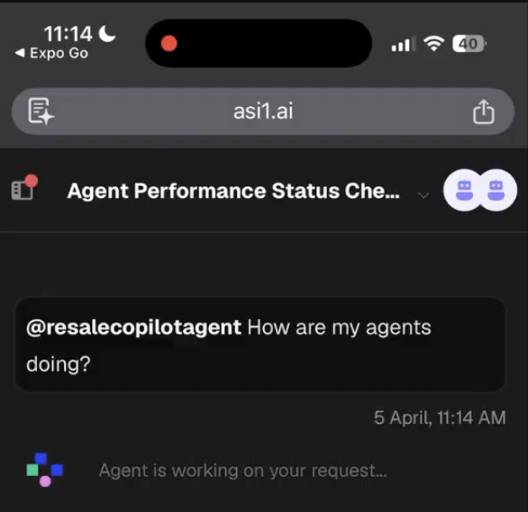
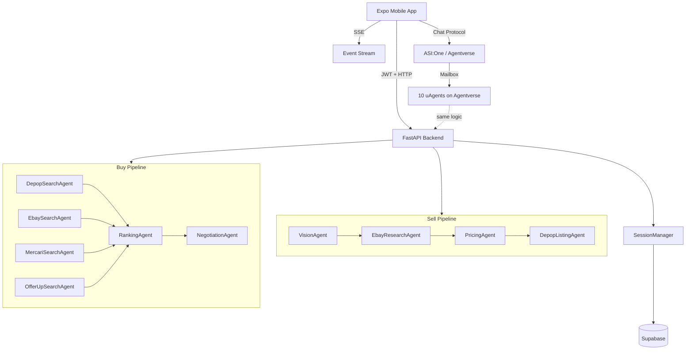

# Fliplt

The secondhand market, but with AI doing all the work on both sides.


<p align="center">
  
</p>

Fliplt is an autonomous resale agent that operates on both sides of the secondhand market. Point it at something in a thrift store and it identifies the item, pulls eBay sold comps, calculates your profit margin, and drafts a Depop listing — all before you leave the aisle. Tell it you want a rare sneaker and a swarm of agents hunts Depop, eBay, Mercari, and OfferUp, ranks the best listings, and sends negotiated offers to sellers automatically.

## Table of Contents
- [What It Does](#what-it-does)
- [The Problem](#the-problem)
- [Our Solution](#our-solution)
- [Demo Flow](#demo-flow)
- [Architecture](#architecture)
- [Agent Roster](#agent-roster)
- [Tech Stack](#tech-stack)
- [Quick Start](#quick-start)
- [Local Setup](#local-setup)
- [Environment Variables](#environment-variables)
- [Deployment](#deployment)
- [Future Work](#future-work)

---

## What It Does

- **Sell mode** — photograph an item at Goodwill, get a profit estimate and a ready-to-post Depop listing in under 60 seconds
- **Buy mode** — describe any niche item; agents search 4 platforms in parallel, rank results by value, and send optimized offer messages to haggle sellers down automatically
- **Live agent dashboard** — every item card shows real-time agent status as pipelines run, surfaced over SSE
- **Autonomous negotiation** — the negotiation agent reads market comps and crafts a per-seller offer message, then submits it via Browser Use without any manual input
- **ASI:One integration** — ask a natural-language question about your agents via Fetch.ai's ASI:One; it discovers and routes to your registered agents on Agentverse
- **Configurable agent behavior** — tune negotiation style (aggressive → passive), response delay, auto-reply, and reply tone per-account

---

## The Problem

Resale is a grind on both sides.

**Sellers** walk into Goodwill, spot something that might be worth flipping, then manually check eBay sold listings, take photos on a bad background, type out a listing, set a price based on gut feel, and hope it sells. The research alone kills the in-store momentum.

**Buyers** hunting for something specific — a rare sneaker, vintage camera, limited-run streetwear — open Depop, eBay, Mercari, and OfferUp in separate tabs, scroll through stale listings, message sellers one by one, and almost always end up paying asking price because follow-up dies in the DMs.

The market is there. The friction is everything between the idea and the transaction.

---

## Our Solution

Fliplt replaces both workflows with autonomous agents.

**The sell loop:**
1. Photograph the item → Vision agent identifies it and pulls a cleaned image
2. Research agent scrapes eBay sold comps via Browser Use
3. Pricing agent computes median price and profit margin
4. Listing agent populates a Depop draft form, ready to post in one tap

**The buy loop:**
1. Describe what you want → four search agents swarm Depop, eBay, Mercari, and OfferUp simultaneously
2. Ranking agent scores every listing by price-to-market and seller reliability
3. Negotiation agent generates a custom offer for each target seller and submits it
4. Conversations surface in the item detail view as replies come in

Every agent runs as a registered Fetch.ai uAgent on Agentverse, implementing the Chat Protocol so ASI:One can discover and orchestrate them. The mobile app talks to the same pipeline over FastAPI + SSE for low-latency demo reliability.

---

## Demo Flow

### 1. Dashboard — your resale portfolio at a glance

P&L chart, net profit, selling items with margin estimates, and buying items with offer statuses. One screen shows you whether the agents are working.

<p align="center">
  
</p>

### 2. Configure your agents

Per-account settings for negotiation style, response delay, auto-reply, and reply tone. Set it aggressive when you're hunting, dial it back when you want to appear casual.

<p align="center">
  
</p>

### 3. Watch the negotiation happen

The item detail view shows the market price range, active platforms, and the live conversation thread as sellers respond to agent-sent offers.

<p align="center">
  
</p>

### 4. Talk to your agents via ASI:One

Ask natural-language questions through Fetch.ai's ASI:One interface. It routes your query to the right registered agent on Agentverse and returns the response.

<p align="center">
  
</p>

---

## Architecture



### Key design decisions

- **Two front doors, one agent system** — FastAPI runs the same 10-agent pipeline in-process for mobile; Fetch.ai/Agentverse exposes the same agents for ASI:One discovery and natural-language orchestration
- **SSE for real-time progress** — `SessionManager` holds state in memory with async pub/sub queues; each agent step publishes events the client streams live
- **3-tier search resolution** — each buy search agent tries `httpx` first, falls back to Browser Use, then to deterministic fallback data. Resilient under demo conditions
- **Sell pipeline pause points** — pipeline suspends after vision (low-confidence correction flow) and after listing draft (user reviews before posting). Both resume cleanly
- **Supabase RLS** — all data scoped to `auth.uid()`; backend verifies item ownership before any pipeline operation

---

## Agent Roster

All 10 agents registered on Agentverse, implementing Chat Protocol, discoverable by ASI:One.

| # | Agent | Pipeline | Responsibility | Key APIs |
|---|---|---|---|---|
| 1 | VisionAgent | SELL | Item identification + clean photo | Gemini Vision, Nano Banana |
| 2 | EbayResearchAgent | SELL | eBay sold comp scraping | Browser Use |
| 3 | PricingAgent | SELL | Median price + profit margin | Gemini |
| 4 | DepopListingAgent | SELL | Depop draft form population | Browser Use |
| 5 | DepopSearchAgent | BUY | Active Depop listing search | Browser Use |
| 6 | EbaySearchAgent | BUY | Active eBay listing search | Browser Use |
| 7 | MercariSearchAgent | BUY | Active Mercari listing search | Browser Use |
| 8 | OfferUpSearchAgent | BUY | Active OfferUp listing search | Browser Use |
| 9 | RankingAgent | BUY | Score + rank all listings | Gemini |
| 10 | NegotiationAgent | BUY | Generate + submit offer per seller | Browser Use, Gemini |

---

## Tech Stack

### Mobile
- React Native + Expo SDK 54
- expo-router v6 (file-based routing)
- Supabase JS client (auth + database)
- NativeWind (Tailwind for RN)

### Backend
- FastAPI + Uvicorn
- Pydantic v2 (strict agent I/O schemas)
- Browser Use + Patchright (Chromium automation)
- Google Gemini (Vision, text generation)

### Infrastructure
- Supabase (Postgres + Auth + Storage + RLS)
- Fetch.ai uAgents + Agentverse Mailbox
- Render (backend deployment)

### AI
- **Gemini Vision** — item identification from photo
- **Gemini text** — pricing, ranking, negotiation message generation
- **Nano Banana** — professional product photo cleanup
- **Browser Use** — live web scraping and form submission across all 4 platforms
- **ASI:One** — natural-language orchestration across the agent network

---

## Quick Start

```bash
# Backend
make install
make run

# Frontend (separate terminal)
cd frontend && npm start
```

Requires `.env` with at minimum `GOOGLE_API_KEY` and `SUPABASE_URL` / `SUPABASE_SERVICE_ROLE_KEY`. See [Environment Variables](#environment-variables).

---

## Local Setup

### Backend

```bash
make install          # creates .venv and installs requirements.txt
make check            # runs tests + compile check
make run              # starts uvicorn on port 8000
```

For live Browser Use flows (scraping + form submission):
```bash
# Chromium is installed by make install via patchright
# Warm browser profiles before demo:
./.venv/bin/python scripts/create_browser_profile.py
./.venv/bin/python -m backend.browser_use_runtime_audit   # verify setup
```

To skip Browser Use and use deterministic fallback data:
```bash
BROWSER_USE_FORCE_FALLBACK=true make run
```

### Frontend

```bash
cd frontend
npm start             # Expo dev server (choose platform from menu)
npm run ios           # iOS simulator
npm run android       # Android emulator
npm run web           # web browser
```

Backend URL defaults to `http://localhost:8000`. Override with `EXPO_PUBLIC_API_URL` in `frontend/.env`.

### Fetch.ai agents (optional)

Requires Python 3.12 or 3.13 (uagents 0.24.0 is incompatible with 3.14):

```bash
make venv-fetch
set -a && source .env && set +a
make run-fetch-agents         # all public Agentverse-facing agents
make run-fetch-agent AGENT=vision_agent   # single agent with inspector URL
```

---

## Environment Variables

| Variable | Default | Purpose |
|---|---|---|
| `GOOGLE_API_KEY` | *(required)* | Gemini Vision + Browser Use |
| `NANO_BANANA_API_KEY` | *(required)* | Gemini key for AI photo analysis |
| `SUPABASE_URL` | *(required)* | Supabase project URL |
| `SUPABASE_SERVICE_ROLE_KEY` | *(required)* | Supabase service role key |
| `SUPABASE_JWT_SECRET` | *(required)* | JWT verification secret |
| `EBAY_APP_ID`, `EBAY_CERT_ID` | *(none)* | eBay Browse API credentials |
| `INTERNAL_API_TOKEN` | `dev-internal-token` | Auth for internal event endpoint |
| `AGENT_EXECUTION_MODE` | `local_functions` | `local_functions` or `http` |
| `BROWSER_USE_FORCE_FALLBACK` | `false` | Skip Chromium, return mock data |
| `BROWSER_USE_GEMINI_MODEL` | `gemini-2.0-flash` | Model for Browser Use flows |
| `FETCH_ENABLED` | `false` | Enable Fetch.ai uAgents layer |
| `SCHEDULER_INTERVAL` | `300` | Seconds between background scheduler polls |
| `APP_BASE_URL` | `http://localhost:8000` | Stream/result URL construction |
| `ALLOWED_ORIGINS` | `*` | CORS origins (comma-separated) |

---

## Deployment

Deployed on Render (`render.yaml`). Build installs Chromium for live Browser Use:

```
pip install -r requirements.txt && python -m patchright install chromium
```

**Notes:**
- Headed Chromium requires a paid Render instance — free tier is not reliable for live Browser Use demos
- Set `GOOGLE_API_KEY`, `SUPABASE_SERVICE_ROLE_KEY`, and `INTERNAL_API_TOKEN` as Render secrets, not in `render.yaml`
- `BROWSER_USE_FORCE_FALLBACK=true` gives a fully functional demo without Chromium if needed
- Run the validation harness before demos: `make verify-browser`

---

## Future Work

- **Parallel buy search** — fan out all 4 platform searches simultaneously (groundwork exists in the Fetch.ai path)
- **In-store scan mode** — barcode + camera scan at Goodwill with instant margin estimate
- **Cross-platform listing** — post to Depop, eBay, and Mercari in one tap
- **Offer tracking** — persistent negotiation threads with seller reply detection and counter-offer handling
- **Web app** — the backend is platform-agnostic; a Next.js frontend is a natural next step

---

Built at DiamondHacks 2026 · UCSD · April 5–6
